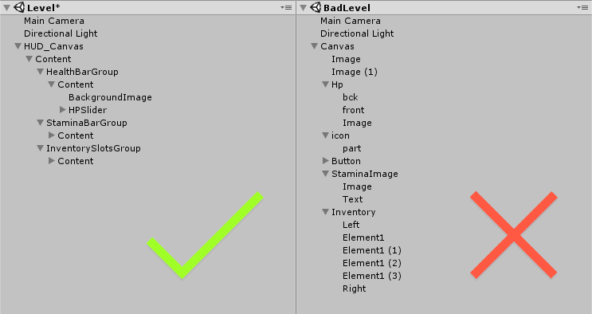
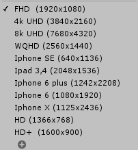
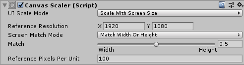
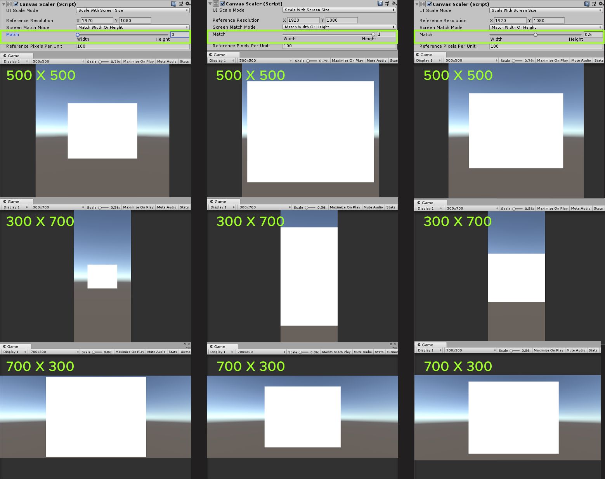
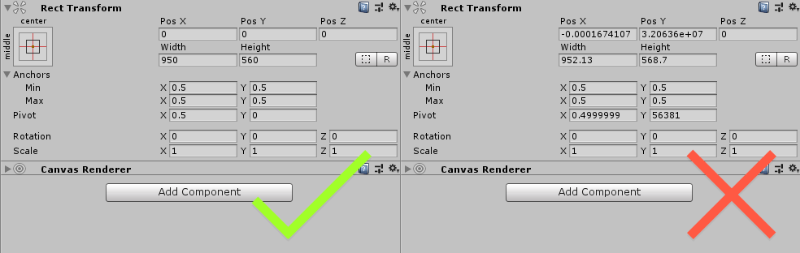
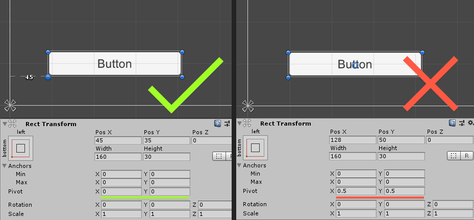
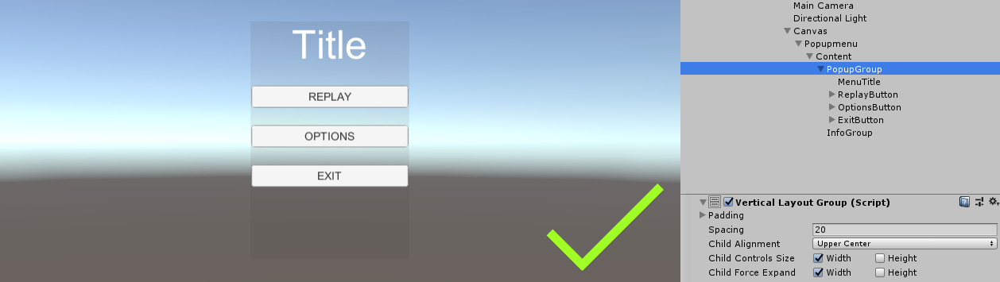
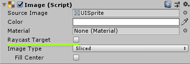
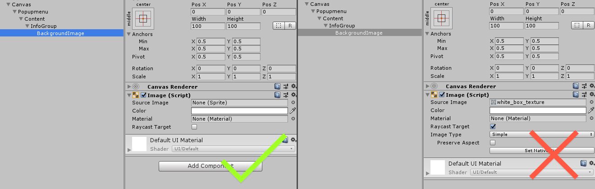

# Unity UI best practices
This list will walk you through UI-specific best practices when working with Unity engine and UI in general. Of course, the situations vary from project to project and goal to goal, but general principles remain the same. This will also be very helpful if there is a team working on UI, including visual and game designers, programmers and any other stakeholders.
## General
1. **Name UI elements sensibly**  
Just like objects in the scene or files in the hierarchy, UI elements should be **named sensibly** with an indicator of the element type. 

2. **Organize smarter**  
Every separate UI entity (e.g. Health Bar, Ammo counter, Stamina Bar etc.) should be organized inside an empty gameObject. Groups of entities that share a visibility state should also be put into a empty gameObject container with a consistent name, “Content” for instance. This is useful when a group of entities should be turned on or of according to the logic of the game.  
Create and use such containers **carefully** because too many unnecessary objects will make the hierarchy too complex and leave a mark on the performance.

2. **Stick to it**  
Stick to whatever naming format you chose internally and follow it across all projects.

3. **A list of common resolutions is your best friend**  
Create a list of common resolutions of the platform that you are targeting. Constantly check newly added UI using this list to make sure that everything scales correctly. 

## Components
4. **Use a Canvas Scaler with consistent resolution across all Canvases**  
If you have more than one canvas, make sure to utilize a preset for the Canvas Scaler that will have a **certain UI Scale mode** and a **Reference Resolution** that will match your target platform's most common resolution.  

5. **Adjust Match appropriately**  
If target platform has many possible resolutions that vary in orientation, it is important to make sure that UI scales correctly. Depending on the prevailing shape of the content on a certain canvas, adjust the Match accordingly. 
Here is an example of how different Match settings affect a **centered 1000*800 rectangle** (such as an inventory menu in a PC game which usually has a landscape-aligned shape):

6. **Keep values in Rect Transform clean**  
Make sure that all values in Rect Transform are cleaned up manually after eye-balled placement of the element. Try to round up numbers to avoid decimals.

7. **Think first, place pivot point after** 
It is very confusing if an element is positioned with an inappropriately placed pivot point. Depending on the location of the element on the screen and his anchor point, adjust pivot point location to keep the element's position predictable when the resolution changes. This is a **general case**, a desired behaviour can vary from case to case and should be taken into consideration when placing both anchors and pivots of elements/containers.

8. **Keep Scale at 1**  
The scale of the UI element should always be 1 by default unless it is slightly changed by animation or a specific use case applies.

9. **Simple layout - Rect Transform, more than several elements - Layout Component**  
Use Rect Transform for creating very simple layouts (like anchoring individual element to a corner of the screen) and Layout Components for layouts with more than several elements or anything that should be stacked.

10. **Disable Raycast Target**  
Disable Raycast Target property for all non-interactive elements straight after you have created them. Graphic Raycaster will perform intersection checks every frame for all elements that are marked as a Raycast Target. In case of complex UI with inappropriately marked elements that  could seriously influence performance.

11. **Use Presets**  
Starting with Unity 2018, use presets for as many common components as possible. Components like Text, Shadow or Outline could be good candidates for having consistent values. 

12. **Avoid Best Fit**  
 If using Unity UI, avoid using Best Fit functionality because it is bad both in terms of design practices (limited number of font sizes rule) and performance. You can find more information on why you should avoid Best Fit [here](https://unity3d.com/ru/learn/tutorials/topics/best-practices/optimizing-ui-controls).
 
13. **Use TextMesh Pro component instead of Text**  
Because of a Signed Distance Field rendering pipeline, TextMesh Pro could be a very good substitution to a Text component if you are looking for a quality text renders for your project. TextMesh Pro uses the same rebuild rules, so optimization consideration is still necessary.

14. **Do not use textures when they are not needed**  
For the UI elements that could be built from white rectangles, do not use any textures, use Image component with an empty source instead. 

## Design

15. **Use Unity Editor as inspiration**  
Elements like Input Field, Slider or ScrollBar should, **by default**, behave similarly to those in Unity Editor.

16. **Make Debug UI discreet**  
All developer (debug) UI should be discreet and not overlap the primary UI in any way.

17. **Keep uniformly colored textures white**  
All uniformly colored textures should be white and colored in the Image  component. This promotes wise use of resources.

18. **Strive for good typography**   
Great typography is a must for achieving a professional look for your game/app. Use high-quality fonts and make sure that there are only one or two fonts used.  
As a rule of a thumb, if you are using one font, you can use up to 3 different styles of that font, including regular, bold and italic. If the number of fonts is more than one, consider cutting on the number of styles to 1 or 2 for each font.
You can find good fonts preselected specifically for apps at [fontshop.com](https://www.fontshop.com/) or [Google Fonts](https://www.fontshop.com/).

19.  **A prefab for each UI entity means easier collaboration**  
If the Unity version you are using does not support nested prefabs, avoid having one humongous prefab for the UI. Instead, try to separate each entity (or whatever fits better logically) of the UI into separate prefabs. This way, if several people are working on it, it will be easier to avoid conflicts when committing. It is also easier to revert changes of specific UI parts if needed.
## Programming

20. **No hiding in alpha**  
Do not use alpha adjustment as a way to hide parts or whole UIs. If any element is invisible but his state is still set to **active**, it will take part in rendering process and use computational resources. Make sure to disable such elements for the period of inactivity.

21. **Pool that scroll**  
Use pooling approach for Scroll Views for cases like leaderboards or any long lists. This will ensure smooth loading, updating and behavior of element-heavy UI objects. For specific pulling techniques visit the [official page.](https://unity3d.com/ru/learn/tutorials/topics/best-practices/optimizing-ui-controls)

22. **Active or Inactive? Your teammate doesn't know**  
Frequently, the logic of the game assumes that some UI is turned on before the start, some appears while the user is interacting with the game/app and some should only appear seldom. 
Make sure that the states for UI elements are not dependent on the last state it was left at in the editor. A designer might not know that for the correct work of the game this, that and that elements on the canvas should be turned on and those other twenty-five turned off. This situation is prone to human error, because even a programmer himself, given large enough number of elements can forget what should be in which state. This practice leads to unnecessary bugs and a lot of time wasted.

## Before you go
23.  **Your product can't end up bad if you have perfected every step**  
Just thinking about creating a great product won't necessarily bring you there. Try increasing quality of every part of the product, every step of the creation process and only then you can expect to succeed.
<!--stackedit_data:
eyJoaXN0b3J5IjpbOTkzNDE1MjAzLC03NDcwMjY3MjQsNTMwNz
g2ODkzLDExMDc4NjI1NjgsMTIzMzMzNDc1NCwxODIyNzY3NTM4
LDIwMDI1Mjc3NDUsMTE0MzQ4MTI0MCwtNDM2MjYzNjYsMTQxND
IwNTU4MiwtMTAxODQxMDgyMCwtMjM3MTcyNjYsLTE3MjYzODEy
OTAsODYwNzEwMDQ0LC0xMzkxMjYwNzIzLC0xMzc2MTgyMjM0LC
04NzI4Nzk1ODAsLTMwNzI0NzQxMCwtMTk1MTUyMTU3NCwtMjA2
NDM4OTQxM119
-->